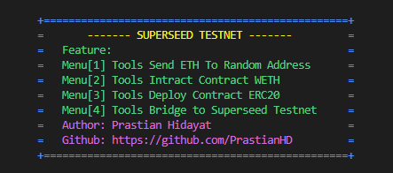

# Superseed Testnet Script



## Installation 
### Clone Repositori
```
git clone https://github.com/PrastianHD/superseed-testnet.git
cd superseed-testnet
```

### Instal Dependensi
```
npm install
```

### Konfigurasi .env File

>create file .env in root project
```bash

PRIVATE_KEY=["your_private_key", "your_private_key"]
```

### Run script
```
npm start
```
